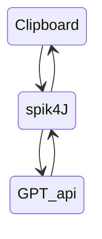

# Spik4J

## Overview

Welcome to Spik4J, your ultimate tool to use during quizes etc. This software uses the power of the ChatGPT and and your Clipboard to provide you with instant answers to your questions.

### Prerequisites

> A computer with internet access.
> 
> A ChatGPT authentication key.

## Getting Started
  1. **Download Spik4J**: Visit the [releases page](https://github.com/Dari-OS/spik4J/releases) to download the latest version of Spik4J or compile the project yourself.
  2. **Run Spik4J**: Run it via the terminal `java -jar path/spik4J.jar <api-key>`. (the api-key is optinal)
  3. **Enter the api key** If you haven't already entered the api key you'll have to do it now.
  
> [!Warning]
> If you run the programm by just double clicking it you have to close it by stopping its process

## Usage

1. **Copy Your Question**: Copy the question you want answered.
2. **Paste Your Answer**: Once the answer is ready, it will be automatically copied to your clipboard (this may take a moment).

## Contact

If you have any questions, suggestions, or feedback, feel free to contact me on Discord: Dari_OS

---

***Disclaimer**: Always use Spik4J responsibly and ethically.*
